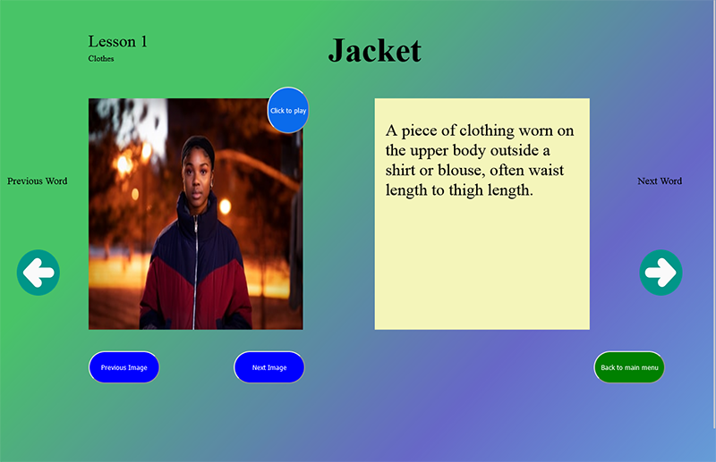
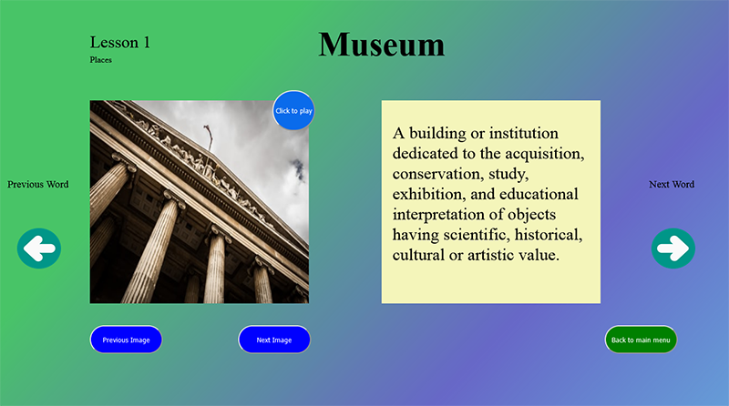
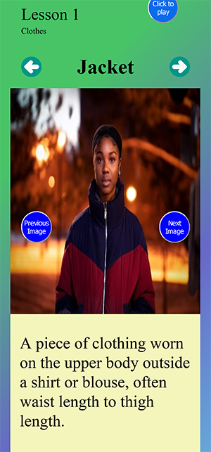

# ** This is a flashcard app in javascript, html, css. ** 

## This app uses a combination of two different APIs to grab dictionary terms, audio files, and images. 

###### I have added the ability to scroll through images that have been fetched through the API. I included the wordslist in a seperate module because  I think if some day I decided to expand upon this it will be much more straight forward process.

In the future I might expand upon it by adding a student dashboard, store the results either in local storage or use some backend as a service ( firebase etc ). I'm also quite sure that a few of the solutions in this app isn't ideal. Most notably the settimeout function call I made. I am sure that there is a better solution, but it is working. I have included a few screenshots. 

